<div align="center">

# 🔐 BhishonSecurity

[](https://python.org)
[](https://nmap.org)
[]()
[]()

<br/>

> **Network vulnerability scanner & recommender.**
> Scans your network, detects vulnerabilities on each node,
> and tells you what actually matters — ranked by real exploitability risk.

<br/>

```
Scan  ──►  Detect  ──►  Prioritize  ──►  Report
```

</div>

---

## ⚙️ Prerequisites

> **Nmap** must be installed on every device intended to scan its gateway network — i.e., any device running `main.py`.

---

## 🚀 Quick Start

```bash
git clone https://github.com/Srijeetop/BhishonSecurity.git
cd BhishonSecurity
pip install -r requirements.txt
```

> [!NOTE]
> If you see `ModuleNotFoundError: No module named nmap`, run:
> ```bash
> pip install python-nmap
> ```

---

## 📖 Usage

```bash
# Step 1 — Last node scans its gateway network and forwards data
python main.py --real --subnet x.x.x.0/24

# Step 2 — Gateway catches and stores the data locally
python catchdata.py

# Step 3 — Gateway scans the network of the gateway it's connected to
python main.py --real --subnet x.x.x.0/24

# Step 4 — Repeat steps 2–3 until the main gateway is reached

# Step 5 — Server catches and stores all collected network data
python servercatchfinaldata.py

# Step 6 — Server generates the complete network map
python servernetworkMapping.py

# Step 7 — Server produces the advanced vulnerability report
python servervulnRep.py
```

---

## 🔁 Flow

```mermaid
flowchart TD
    A([🖥️ Last Node]):::start --> B

    subgraph LOOP ["↻  Repeats per network hop"]
        B["📡 Scan Subnet\n`main.py`"]:::action --> C
        C["📥 Gateway Catches Data\n`catchdata.py`"]:::action --> D
        D{"Main Gateway\nReached?"}:::decision
    end

    D -- No --> B
    D -- Yes --> E

    E["🗄️ Server Catches Total Data\n`servercatchfinaldata.py`"]:::server --> F
    F["🗺️ Generate Network Map\n`servernetworkMapping.py`"]:::server --> G
    G["📋 Generate Vulnerability Report\n`servervulnRep.py`"]:::server --> H

    H([✅ Done]):::done

    classDef start    fill:#0d3b2e,stroke:#00ff9d,stroke-width:2px,color:#00ff9d
    classDef action   fill:#0a1a2e,stroke:#1e4d7a,stroke-width:1px,color:#c8d8e8
    classDef decision fill:#2e0d1a,stroke:#ff4d6d,stroke-width:2px,color:#ff4d6d
    classDef server   fill:#0a1e2e,stroke:#00b4d8,stroke-width:1px,color:#90e0ef
    classDef done     fill:#0d3b2e,stroke:#00ff9d,stroke-width:2px,color:#00ff9d
```



---

## ⚠️ Disclaimer

> [!WARNING]
> **For authorized use only.** Only scan systems you own or have explicit permission to test. Unauthorized scanning may violate laws and regulations.
